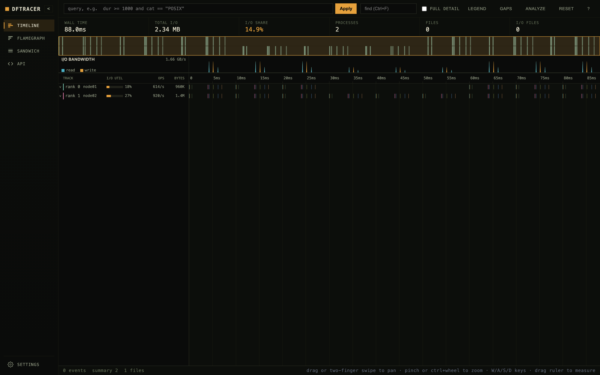
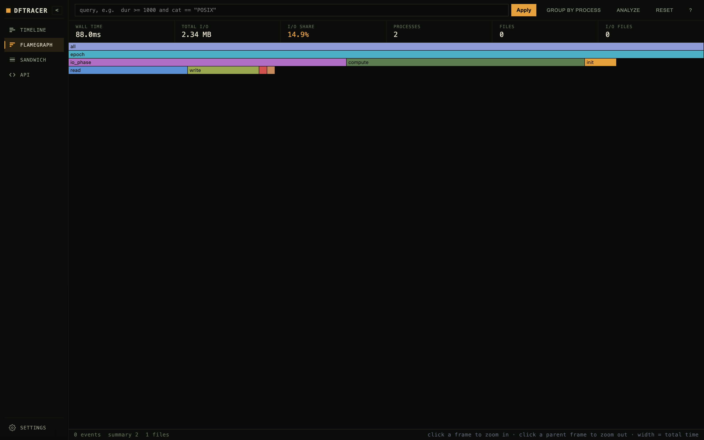
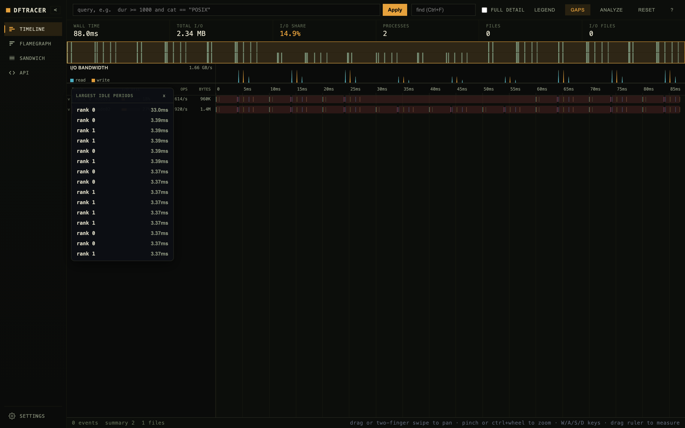

# DFTracer Viewer (VS Code)

Open [DFTracer](https://dftracer.readthedocs.io/) traces (`.pfw` / `.pfw.gz`) in
an interactive timeline inside VS Code. The extension downloads a prebuilt
`dftracer_server` from
[dftracer-utils](https://github.com/LLNL/dftracer-utils), runs it on your trace
directory, and shows the timeline it serves - no separate install required.



<p>
  
  
</p>

## Features

- Pan/zoom timeline with density level-of-detail re-query (stays fast on large traces).
- Lanes grouped by host or ordered flat by rank; flamegraph and caller/callee sandwich.
- Gap/idle analysis, I/O bandwidth strip, a full query box, and per-metric help tooltips.
- Works over Remote-SSH / Codespaces / devcontainers (the server runs on the remote host).

## Usage

- **Double-click** a `.pfw` / `.pfw.gz` file, or
- Right-click a trace file -> **DFTracer: View Trace**, or a folder -> **DFTracer: View Traces**, or
- Run **DFTracer: View Trace** / **DFTracer: View Traces** from the command palette.

On first use the extension downloads the `dftracer_server` binary for your
platform from
[dftracer-utils-prebuilds](https://github.com/rayandrew/dftracer-utils-prebuilds)
and caches it. Prebuilts are available for macOS and Linux (x64 / arm64).

## Choosing the server

Run **DFTracer: Select Server** from the command palette to pick where the
server comes from - download the prebuilt one, browse for a `dftracer_server`
binary, or type a path - much like selecting a Python interpreter. The viewer's
start screen has the same "use your own build" field, and the choice is stored
in `dftracer.viewer.serverPath`.

To fetch a newer prebuilt later, run **DFTracer: Update Server**; it re-downloads
the selected release and reloads the open viewer.

## Settings

| Setting                         | Default  | Purpose                                                                                                |
| ------------------------------- | -------- | ------------------------------------------------------------------------------------------------------ |
| `dftracer.viewer.serverPath`    | (empty)  | Path to a `dftracer_server` binary; when set, skips the download.                                      |
| `dftracer.viewer.serverRelease` | `latest` | Which prebuilds release to download (`latest` or a tag like `v1.2.3.post5`).                           |
| `dftracer.viewer.indexDir`      | (empty)  | Trace index directory (`--index-dir`). Empty builds it in a temp dir removed on close; set to persist. |
| `dftracer.viewer.extraArgs`     | `[]`     | Extra CLI args passed to `dftracer_server`.                                                            |

## How it works

Each opened trace directory gets one `dftracer_server` process on a free
localhost port, mapped through `vscode.env.asExternalUri` (so it works in
Remote-SSH / Codespaces / devcontainers). The webview loads the UI the server
serves at `GET /`; servers are reference-counted and stopped when their last
viewer tab closes. Opening traces from different folders runs independent
servers; opening several files from one folder shares a server, each tab scoped
to its file. Unless `indexDir` is set, the index lives in a temporary directory
that is removed when the server stops.

## Develop

```bash
npm install
npm run compile   # or: npm run watch
npm test          # headless VS Code tests
```

Press F5 in VS Code to launch an Extension Development Host (it generates sample
traces under `fixtures/` and opens them).

## Related

- [dftracer-utils](https://github.com/LLNL/dftracer-utils) - the `dftracer_server`
  and trace tooling this viewer runs.
- [dftracer-utils-prebuilds](https://github.com/rayandrew/dftracer-utils-prebuilds) -
  the per-platform server binaries the extension downloads.
- [DFTracer](https://dftracer.readthedocs.io/) - the tracer that produces the
  `.pfw` / `.pfw.gz` files.
